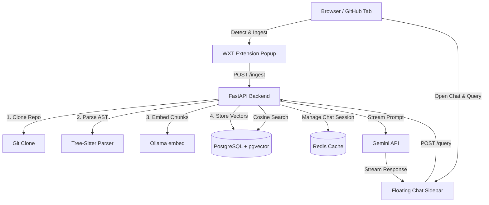

<p align="center">
  
</p>

<h3 align="center">askRepo</h3>

<p align="center">A browser extension that lets you chat with any GitHub repository using natural language.</p>

---

`askRepo` is a self-hosted tool made up of a browser extension and a FastAPI backend. Navigate to any GitHub repository, index it once, and a floating chat panel appears on the page. Queries are answered using retrieval-augmented generation — the backend parses the codebase with Tree-Sitter, stores AST-level code chunks in a local `pgvector` database, and streams responses through Gemini.

No code leaves your machine except the natural language queries sent to Gemini.

---

## Features

- **Automatic repo detection.** The extension reads the current GitHub URL and wires up without any manual input.
- **AST-based chunking.** Files are split by logical symbols — classes, methods, interfaces, functions — using Tree-Sitter, not arbitrary line counts.
- **Vector similarity search.** Chunks are embedded locally via Ollama and indexed in PostgreSQL with `pgvector`. Retrieval is by cosine similarity.
- **Floating chat panel.** Injected into the GitHub page via Shadow DOM so it never conflicts with existing page styles.
- **Context-aware conversation.** Session history is persisted in Redis. When token limits approach, older turns are automatically summarized by Gemini to preserve context without truncation.
- **Streaming responses.** Answers stream in real time using the Google GenAI SDK.

## Supported Languages

Tree-Sitter AST parsing covers **Python, JavaScript, TypeScript, Go, Rust, Java, and C/C++**, extracting classes, functions, methods, interfaces, structs, traits, enums, and constructors.

---

## Architecture



**Frontend:** WXT, React 19, TypeScript, Tailwind CSS 4, Radix UI, Shadcn, Lucide Icons

**Backend:** FastAPI, SQLModel, PostgreSQL + pgvector, Redis, Ollama, Google GenAI SDK

---

## Installation

### Prerequisites

| Dependency | Notes |
|---|---|
| Node.js v18+ and Bun | Bun recommended; npm/yarn also work |
| Python 3.10+ | |
| PostgreSQL | with the `pgvector` extension enabled |
| Redis | listening on port `6379` |
| Ollama | listening on port `11434`; `nomic-embed-text` model required |
| Gemini API key | available from [Google AI Studio](https://aistudio.google.com) |

---

### Backend

```bash
cd backend
python -m venv .venv
source .venv/bin/activate        # Windows: .venv\Scripts\Activate.ps1
pip install -r requirements.txt
```

Create `backend/.env`:

```env
DATABASE_URL="postgresql://<user>:<password>@localhost/<dbname>"
GEMINI_API_KEY="your-gemini-api-key"
REDIS_URL="redis://localhost:6379/0"
OLLAMA_BASE_URL="http://localhost:11434"
EMBEDDING_MODEL="nomic-embed-text"
```

Then enable the pgvector extension and pull the embedding model:

```sql
-- run inside your PostgreSQL instance
CREATE EXTENSION IF NOT EXISTS vector;
```

```bash
ollama pull nomic-embed-text
```

---

### Frontend

```bash
cd frontend
bun install
```

Create `frontend/.env`:

```env
BASE_API_URL="http://localhost:8000"
```

---

### Running

From the project root:

```bash
make dev           # FastAPI at http://localhost:8000
make dev-frontend  # WXT dev mode
```

Or manually:

```bash
cd backend && fastapi dev
cd frontend && bun dev
```

---

### Loading the Extension

1. Open Chrome or any Chromium browser and navigate to `chrome://extensions/`
2. Enable **Developer mode** using the toggle in the top-right corner
3. Click **Load unpacked** and select `frontend/.output/chrome-mv3`
4. The askRepo icon will appear in your toolbar

---

## Usage

1. Go to any GitHub repository page — for example, `https://github.com/fastapi/fastapi`
2. Click the askRepo icon in your browser toolbar
3. Click **Index Repository**
4. Wait for the backend to clone the repo, parse AST nodes, embed chunks, and populate the vector database
5. Once indexing completes, a chat bubble appears in the bottom-right corner of the GitHub page
6. Click it to open the chat panel and start querying the codebase

---

## API Reference

| Method | Endpoint | Description |
|---|---|---|
| `GET` | `/` | Health check |
| `POST` | `/ingest` | Clone and index a repository as a background task |
| `POST` | `/query` | Stream a response for a natural language query |
| `GET` | `/status` | Poll ingestion status for a job ID or repo name |
| `GET` | `/repos` | List all indexed repositories with pagination |

---
